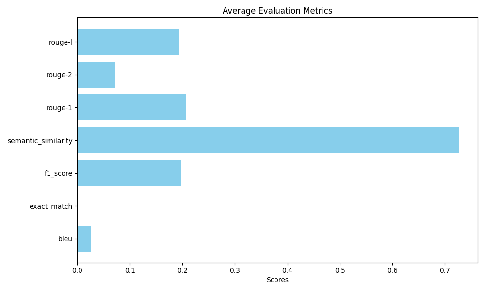

# AI Document Retrieval System

## Overview

This project implements an AI-powered document retrieval system using Python, LangChain, OpenAI models, and Streamlit. The system processes PDF documents, indexes them using vector embeddings, and provides a user-friendly interface for querying and retrieving relevant information.

## Features

- PDF document ingestion and indexing
- Vector-based document retrieval using ChromaDB
- Query expansion for improved search results
- Document reranking with FlashrankRerank
- Summarization of retrieved information
- Streamlit-based web interface

## Components

### Backend

1. `indexing.py`: Handles document ingestion, processing, and indexing.
2. `querying.py`: Manages query processing, document retrieval, and summarization.
3. `utils.py`: Contains utility functions, including logging setup and function for remove duplicates from generated evaluation dataset

### Frontend

- `app.py`: Implements the Streamlit web interface for user interactions.

### Prompts

- `query_expansion.jinja2`: Template for query expansion.
- `summarize.jinja2`: Template for generating summaries.
- `generate_evaluation_set.jinja2`: Template for pasting to GPT-4o together with PDF document. Purpose is to create evaluation test set.

## Setup

1. Clone the repository
2. Install dependencies:
   ```
   pip install -r requirements.txt
   ```
3. Set up environment variables in a `.env` file:
   ```
   PDF_DIR=path/to/pdf/documents
   DB_DIR=path/to/vector/store
   DB_COLLECTION=your_collection_name
   EMBEDDING_MODEL=text-embedding-3-small
   CHAT_MODEL=gpt-3.5-turbo
   CHAT_TEMPERATURE=0.7
   SEARCH_RESULTS_NUM=5
   LANGSMITH_PROJECT=your_langsmith_project_name
   OPENAI_API_KEY=your_openai_api_key
   LANGSMITH_API_KEY=your_langsmith_api_key
   ```

## Usage

1. Run the indexing script to process and index documents:
   ```
   python backend/indexing.py
   ```

2. Start the Streamlit app:
   ```
   streamlit run frontend/app.py
   ```

3. Open the provided URL in your web browser to access the AI Document Retrieval Interface.

4. Enter your query in the search box and use the sidebar to apply filters if needed.

5. View the summarized results, retrieved documents, and provide feedback on the results.


## Evaluation and Result Interpretation

The system is evaluated using a variety of metrics that assess the quality of retrieved documents and generated answers. The evaluation is performed on a dataset of questions related to the documents, stored in data/evaluation_dataset.json.

### Metrics Used
The metrics in the provided RAGEvaluator class are well-defined, and they calculate typical NLP evaluation scores such as precision, recall, F1, BLEU, ROUGE, and semantic similarity.

Here's a review of the metrics and their accurate implementation:

- **Precision@k:**  
Measures how many of the top k retrieved documents are relevant. A higher value indicates more relevant documents in the top results. It uses exact word matches between the retrieved document's content and the reference answer. Relevance matching is done via exact word overlap instead of use embeddings or semantic similarity to measure relevance.

- **Mean Reciprocal Rank (MRR):** 
Measures how early the first relevant document appears in the ranked list of retrieved documents. A higher MRR indicates relevant documents are ranked higher. It will return 0 if no relevant document is found. It's calculated by finding the first relevant document and computing 1/(rank of first relevant document).

- **BLEU:** 
Evaluates the overlap of n-grams (e.g., sequences of words) between the generated answer and the reference answer. Smoothing is applied to handle cases with low n-gram overlap. A higher BLEU score indicates better match quality.

- **Exact Match (EM):**
Checks if the generated answer exactly matches the reference answer (case-insensitive). A score of 1 means the answers are identical, while 0 means they are different.

- **F1 Score:** 
Balances precision and recall at the token level. It measures how much the generated answer overlaps with the reference answer in terms of words. A higher F1 score indicates better word overlap.


- **Semantic Similarity:** 
Uses cosine similarity between sentence embeddings (via SentenceTransformer) of the generated and reference answers to evaluate semantic closeness. A higher value indicates the generated answer is semantically similar to the reference, even if worded differently.


- **ROUGE-1, ROUGE-2, ROUGE-L:** 
Measures n-gram (unigrams, bigrams, and longest common subsequences) overlap and longest common subsequence between the generated and reference answers. ROUGE-1 considers single words, ROUGE-2 considers bigrams, and ROUGE-L considers the longest matching sequence. Higher values indicate more overlap.


### Example Results
An example of the evaluation for the question: "What is the purpose of multi-head attention in transformers?"

```json
{
  "question": "What is the purpose of multi-head attention in transformers?",
  "precision@1": 1.0,
  "precision@3": 1.0,
  "precision@5": 0.6,
  "mrr": 1.0,
  "bleu": 0.0011199943070059005,
  "exact_match": 0,
  "f1_score": 0.04615384615384615,
  "semantic_similarity": 0.5160347,
  "rouge-1": 0.08219177954588106,
  "rouge-2": 0.0,
  "rouge-l": 0.08219177954588106
}
```
### Average Metrics Across All Questions

The image below shows the average of each evaluation metric across all questions in the dataset:

(**Note**, dataset was not created properly, "context" is not exactly cut text from PDFs, need to fix it)



### Interpretation of Results
High precision and MRR values indicate that the system is good at retrieving relevant documents early in the ranking.

Low BLEU and Exact Match scores suggest that while the system retrieves relevant information, the generated answers may not closely match the reference answers in terms of wording.

F1 Score and ROUGE scores show some overlap between the generated answers and reference answers, but not at a high level.

Semantic Similarity demonstrates that while the exact wording may differ, the generated answers are generally semantically close to the reference answers.


## Evaluation Dataset Creation
To evaluate the performance of the RAG (Retrieval-Augmented Generation) system, an evaluation dataset needs to be created. The dataset will consist of questions related to the content of the ingested PDF documents, along with context and answers derived from those documents. The following approach outlines how evaluation dataset was created.

### Steps to Create the Evaluation Dataset (data/evaluation_dataset.json)
Upload Documents: Upload the required PDF documents into the GPT-4o.
Use GPT-4o for Dataset Creation: Use GPT-4o to generate questions, context, and answers by analyzing the content of the uploaded documents.
Format the Dataset: Format the generated data into JSON format, ensuring that each data entry includes:
A unique ID for each question.
The question derived from the content.
The relevant context from the document.
The correct answer extracted from the context.


```json
[
  {
    "id": 1,
    "question": "What is the main goal of the Rewrite-Retrieve-Read framework introduced in the paper?",
    "context": ["This work introduces a new framework, Rewrite-Retrieve-Read, which aims to improve retrieval-augmented large language models by focusing on query rewriting rather than just adapting the retriever or reader components.", ...],
    "answer": "The main goal of the Rewrite-Retrieve-Read framework is to improve retrieval-augmented LLMs by focusing on query rewriting."
  },
  ...
]
```


## Advanced Features

- Query expansion: Enhances user queries for better document retrieval.
- Document reranking: Improves the relevance of retrieved documents.
- User feedback: Collects and stores user feedback using LangSmith for continuous improvement.

## Logging

The system uses Python's logging module to track important events and errors. Logs are configured in `utils.py` and can be customized as needed.

## Contributing

Contributions to this project are welcome. Please ensure that you follow the existing code style and add appropriate tests for new features.

## License

This project is licensed under the terms of MIT 2.0 licence. See the LICENSE file for details.
