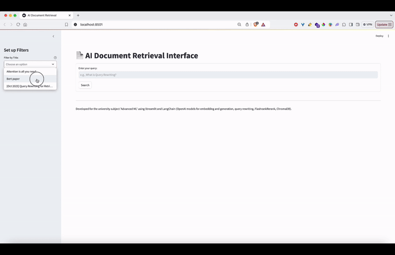

# AI Document Retrieval System

## Overview

This project implements an AI-powered document retrieval system using Python, LangChain, OpenAI models, and Streamlit. The system processes PDF documents, indexes them using vector embeddings, and provides a user-friendly interface for querying and retrieving relevant information. The system aims to improve retrieval-augmented generation (RAG) pipelines, combining document retrieval with large language models (LLMs) for enhanced accuracy in generated answers by accessing relevant documents efficiently.

## Features

- PDF document ingestion and indexing using ChromaDB
- Vector-based document retrieval for efficient search
- Query rewriting for improved search accuracy
- Document reranking with FlashrankRerank for relevance optimization
- Summarization of retrieved documents
- Streamlit-based web interface for easy interaction
- Features like query rewriting and user feedback integration using LangSmith

## Components

### Backend

1. **`indexing.py`**: Handles PDF document ingestion and indexing into ChromaDB. It processes documents into chunks, generates vector embeddings, and stores them in the database for efficient retrieval.
2. **`querying.py`**: Manages query processing, query rewriting, document retrieval, reranking, and summarization. It uses vector embeddings to retrieve documents and applies query expansion and reranking for better results.
3. **`utils.py`**: Contains utility functions for logging and generating a deduplicated evaluation dataset.

### Frontend

- **`app.py`**: Implements the Streamlit web interface for user interactions. It allows users to input queries, apply filters, and view summarized results and retrieved documents.
  
  

### Prompts

- **`query_expansion.jinja2`**: Template for query expansion to improve the precision of searches.
- **`summarize.jinja2`**: Template for generating concise summaries of retrieved documents.
- **`generate_evaluation_set.jinja2`**: Template for creating an evaluation dataset by extracting questions and answers from PDF documents using GPT-4o.

## Setup

### Prerequisites

Before running the system, ensure you have the necessary dependencies installed and that you have set up your environment variables.

### Installation Steps

1. Clone the repository:
   ```bash
   git clone https://github.com/your-username/ai-document-retrieval-system.git
   cd ai-document-retrieval-system
   ```

2. Install dependencies:
   ```bash
   pip install -r requirements.txt
   ```

3. Copy `.env.example` to `.env` and add values for environment variables:
   ```bash
   cp .env.example .env
   ```
   In the `.env` file, fill in:
   - `OPENAI_API_KEY`: Your OpenAI API key
   - `LANGSMITH_API_KEY`: Your LangSmith API key

4. Run the indexing script to process and index PDF documents located in the `data/pdfs` folder:
   ```bash
   python backend/indexing.py
   ```

5. Start the Streamlit app:
   ```bash
   streamlit run frontend/app.py
   ```

6. Open the provided URL in your web browser to access the AI Document Retrieval Interface.

## Usage

### Querying

- Enter a query in the search box and hit enter.
- The system will retrieve relevant documents, rank them by relevance, and display summarized results.
- You can apply filters and provide feedback on the relevance of the results via the sidebar.

### Evaluation

To evaluate the system:

1. Run the evaluation script:
   ```bash
   python backend/rag_evaluation.py
   ```

2. The evaluation results will include metrics like precision@k, MRR, BLEU, F1 score, ROUGE, and semantic similarity.

## Evaluation and Results

The system is evaluated using a dataset stored in `data/evaluation/evaluation_dataset.json`. Below are the metrics used in evaluation:

### Metrics Used

- **Precision@k**: Measures how many of the top k retrieved documents are relevant.
- **Mean Reciprocal Rank (MRR)**: Evaluates how early the first relevant document appears in the ranked list.
- **BLEU**: Measures n-gram overlap between generated and reference answers.
- **Exact Match (EM)**: Evaluates whether the generated answer exactly matches the reference answer.
- **F1 Score**: Balances precision and recall at the word level between generated and reference answers.
- **Semantic Similarity**: Uses sentence embeddings to evaluate how semantically close the generated answer is to the reference answer.
- **ROUGE-1, ROUGE-2, ROUGE-L**: Measures unigram, bigram, and longest common subsequence overlap between generated and reference answers.

### Example Results

Example evaluation result for the question: "What is the purpose of multi-head attention in transformers?"

```json
{
  "question": "What is the purpose of multi-head attention in transformers?",
  "precision@1": 1.0,
  "precision@3": 1.0,
  "precision@5": 0.6,
  "mrr": 1.0,
  "bleu": 0.0011,
  "exact_match": 0,
  "f1_score": 0.0462,
  "semantic_similarity": 0.5160,
  "rouge-1": 0.0822,
  "rouge-2": 0.0,
  "rouge-l": 0.0822
}
```

### Average Metrics Across All Questions


**Note**: The dataset was not created properly, and "context" was not exactly cut text from PDFs. This will be fixed in future versions.

## Evaluation Dataset Creation

To evaluate the system, an evaluation dataset is created using GPT-4o by generating questions, context, and answers from PDF documents.

### Steps to Create the Evaluation Dataset

1. **Upload Documents**: Upload relevant PDF documents into GPT-4o.
2. **Dataset Generation**: Use GPT-4o to generate questions, context, and answers from the content of the documents.
3. **Dataset Formatting**: Structure the generated dataset into a JSON format with unique IDs, questions, context, and answers.

Example dataset entry:

```json
{
  "id": 1,
  "question": "What is the main goal of the Rewrite-Retrieve-Read framework introduced in the paper?",
  "context": ["This work introduces a new framework, Rewrite-Retrieve-Read, which aims to improve retrieval-augmented large language models by focusing on query rewriting rather than just adapting the retriever or reader components."],
  "answer": "The main goal of the Rewrite-Retrieve-Read framework is to improve retrieval-augmented LLMs by focusing on query rewriting."
}
```

## Advanced Features

- **Query Expansion**: Improves the precision of document retrieval by expanding user queries.
- **Document Reranking**: Enhances the relevance of retrieved documents using a reranking algorithm.
- **User Feedback Integration**: Collects feedback through LangSmith for continuous improvement of the retrieval and summarization pipeline.

## Logging

Logging is configured via the `utils.py` file, using Python's logging module. The logs can be customized for different levels (INFO, DEBUG, ERROR).

## Contributing

Contributions are welcome! Please follow the code style, add tests for new features, and ensure proper documentation.

## License

This project is licensed under the MIT License. See the [LICENSE file](LICENSE) for details.
